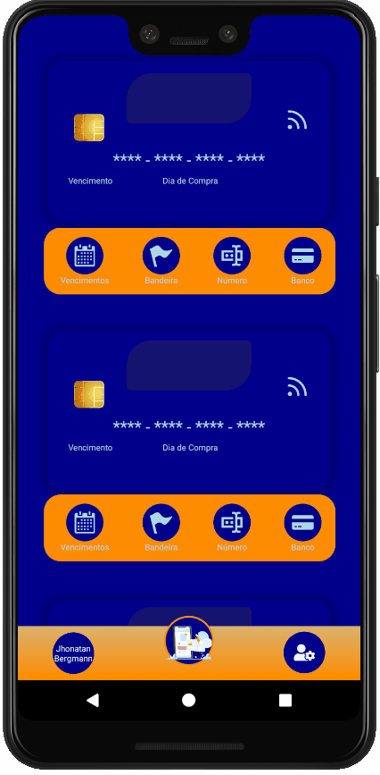

<h1 align="center">
  
  <br>
  Card Wallet
  <br>
</h1>

<p align="center">
  
  
  
  
</p>

<p align="center">Carteira de cartões.</p>

<p align="center">
   
</p>
<p align="center">
   
   
   
   
   
   
</p>
<p align="center"> 
   
</p>

## 📅 Sobre

Aplicação desenvolvida para auxiliar na organização de cartões, o app é uma "carteira" que possibilita adicionar dados aos cartões disponíveis no app com os dados do seu cartão real. Tem como alterar e/ou adicionar o vencimento da fatura, o melhor dia de compra, bandeira (MasterCard ou Visa), número final do cartão, entidade bancaria, senha e permite customizar a cor de cada cartão. Os dados são salvos e persistentes na memória do dispositivo e ainda conta com notificações com o OneSignal. 

<i>Aplicação desenvolvida para ajudar meu pai, que sempre esquecia do vencimento da fatura de seus cartões.</i>

## 🔔 Notificações | OneSignal

Para enviar notificações você precisa ter uma conta em onesignal.com, após as configuração basta colocar o App ID: em `OneSignal.init('')` dentro do `useEffect` no componente Home.js, assim:
<br /><br />
`import OneSignal from 'react-native-onesignal'`
<br /><br />
`useEffect(() => {`<br />
    `OneSignal.init('APP ID')`<br />
    `OneSignal.addEventListener('opened', onOpened)`<br />
    `return () => OneSignal.removeEventListener('opened', onOpened)`<br />
`}, [])`
<br /><br />
ID:<br />
<p align="center">
   
</p>

## 🛠 Tecnologias
- [React Native](https://facebook.github.io/react-native/)
- [Javascript](https://devdocs.io/javascript/)

## 📱 Executando 

Para executar o projeto é necessário que você tenha o ambiente React Native configurado, você pode seguir esse [GUIA](https://reactnative.dev/docs/environment-setup) para tal.

Depois de configurar o ambiente, basta fazer o clone do projeto:

```sh
git clone https://github.com/jhonbergmann/card-wallet.git
```

Entre na pasta do projeto e execute o comando para instalar as dependências do projeto:

```sh
yarn install
```
ou
```sh
npm install
```

Em seguida execute o comando referente a plataforma ao qual deseja executar:

Android:

```sh
react-native run-android
```

## 📝 Licença

Esse projeto está sob a licença MIT. Veja o arquivo [LICENSE](LICENSE) para mais detalhes.

---

<p align="center">
 Feito com 💜 by Jhonatan Bergmann
</p>
